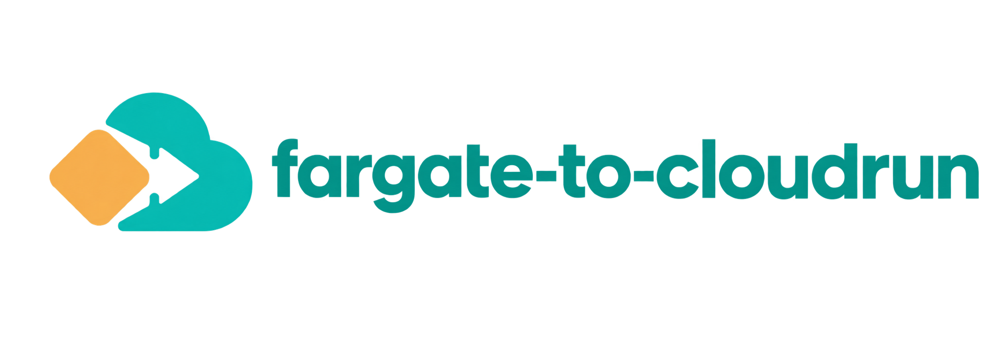
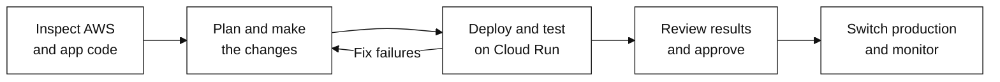

<p align="center">
  
</p>

**From Fargate to Cloud Run — without learning a second cloud from scratch.**

<p align="center">
  <a href="https://github.com/Robertzu43/fargate-to-cloudrun/actions/workflows/tests.yml"></a>
  <a href="https://github.com/Robertzu43/fargate-to-cloudrun/actions/workflows/docdrift.yml"></a>
  <a href="https://github.com/Robertzu43/fargate-to-cloudrun/releases/latest"></a>
  <a href="LICENSE"></a>
</p>

This skill gives your agent a migration workflow and supporting scripts. It guides the agent to
inspect your ECS/Fargate app, adapt its code and configuration, deploy to Cloud Run, test it,
and switch production with your approval. You provide access and decide on cost and downtime;
the agent handles the cloud configuration.

> **Early release.** The helper scripts have automated tests. The full workflow has not yet been
> independently validated on real migrations. Start with a non-production app.

[Quickstart](#quickstart) · [How it works](#how-it-works) · [What it does](#what-it-does) · [Documentation](#documentation)

## Quickstart

### 1. Install the skill

Run this in your terminal and select your coding agent:

```bash
npx skills add Robertzu43/fargate-to-cloudrun
```

This installer requires Node.js/npm. The skill is intended for agents such as Claude Code,
Codex and Gemini CLI; the complete workflow has not yet been verified across all of them.

<details>
<summary>Install manually with Git</summary>

From your application's repository, choose the directory your agent reads:

```bash
# Claude Code
git clone https://github.com/Robertzu43/fargate-to-cloudrun .claude/skills/fargate-to-cloudrun

# Codex / agents that read .agents/skills
git clone https://github.com/Robertzu43/fargate-to-cloudrun .agents/skills/fargate-to-cloudrun
```

For other agents, use their supported skill installation flow. Keep the scripts beside `SKILL.md`.

</details>

### 2. Open your app

Open your application's repository in your coding agent. For the initial assessment, you need
**Python 3.9+ and the AWS CLI signed in** with permission to inspect your ECS application.
Source code helps the agent find changes that AWS configuration alone cannot reveal.

You can start without a Google Cloud project. The agent helps you set up Google Cloud access,
billing, permissions and Docker when deployment requires them.

### 3. Ask for a migration

```text
Use the fargate-to-cloudrun skill to migrate this application from AWS to Cloud Run.

1. Inspect my ECS services and application code. Identify dependencies and blockers.
2. Explain the proposed changes, estimated costs and expected downtime.
   Ask before creating billable resources or transferring secrets.
3. Make the approved changes, deploy privately and test the critical application flows.
   Fix failures before proposing a production switch.
4. Show me the results and rollback plan. Ask before moving production traffic.
5. After the switch, monitor the app and document how to deploy it again.
   Keep AWS resources until I approve their removal.
```

If you do not know your ECS service names, the agent can look them up. It should first explain
what it found, what needs to change, and anything that prevents the move.

## How it works



The agent keeps a `migration.md` record in your project with the plan, changes, test results
and rollback steps. Testing includes your app's critical flows—not just a responding health endpoint.

You approve billable resource creation and secret transfers before they happen. Switching live
traffic and retiring AWS resources are separate approvals. AWS stays available during the agreed
rollback window; database changes need their own recovery plan.

## What it does

**The strongest starting point is a containerized HTTP app.** More complex applications require
work specific to their dependencies and behavior.

| Area | What is available today |
|---|---|
| ECS HTTP services | Scripts to collect configuration, identify migration issues and generate deployment files once findings are resolved. |
| AWS secrets | A transfer helper for Secrets Manager and SSM, including selected JSON keys and versions. Secret values are not printed or written to local output files. |
| App code and dependencies | Instructions for the agent to investigate and implement changes to code, networking, databases, queues, storage, sidecars and workers. These are not automatic conversions. |
| Production switch | Instructions for application testing, your approval, traffic changes, monitoring and rollback. No universal cutover script. |

Cloud Run is not a fit for every workload. The agent should explain incompatible requirements
before proceeding. An assessment that passes is a **candidate for testing**, not proof of a completed migration.
The generator stops when findings are unresolved instead of silently dropping requirements.

Environment values are withheld by default, but collected inventories can still contain sensitive
information. Keep them out of Git and public issues. Cloud resources may incur charges throughout
testing and the rollback window.

## Documentation

- [Agent instructions](SKILL.md) — the workflow your coding agent follows.
- [Migration guide](references/migration-workflow.md) — dependencies, testing, production cutover and rollback.
- [Working example](examples/configured-api/README.md) — an app that checks configuration and authenticated requests.
- [Mapping rules](references/rules.json) — mappings and their official sources. Documentation checks flag missing excerpts; they do not prove compatibility or catch every platform change.

<details>
<summary>Run the helper scripts yourself</summary>

Run these commands from a clone of this repository. Normal skill usage does not require running them manually.

The fixtures exercise the local assessment and generator. They do not demonstrate a completed live migration.

```bash
python3 scripts/assess.py \
  --inventory fixtures/stateless-http/inventory.json \
  --src fixtures/stateless-http/src \
  --out assessment.json

# Prints proposed source/destination references. No values are read; no provider calls are made.
python3 scripts/transfer_secrets.py --assessment assessment.json --project my-project

python3 -m unittest discover -s tests -v
```

For a real application with secrets, use its own `inventory.json` and `assessment.json`.
Executable generation requires the actual destination versions:

```bash
# Only after the user has approved the source references and destination project.
# Secret Manager must be enabled and the operator must have the required permissions.
python3 scripts/transfer_secrets.py --assessment assessment.json \
  --project my-project --apply --versions-out secret-versions.json

python3 scripts/generate.py --inventory inventory.json --assessment assessment.json \
  --project my-project --region us-central1 \
  --secret-versions secret-versions.json --out-dir out
```

Do not run the synthetic fixture's transfer with `--apply`: its AWS references are examples.
The deployed artifacts are `out/service.yaml` and `out/deploy.sh`. The agent reviews and executes them
within the approved scope, then runs application-level verification. For apps without secrets, omit
`--secret-versions`.

See [the functional example](examples/configured-api/README.md) for a small application that distinguishes
“the server is up” from “the required configuration and application behavior work.”

</details>

## Feedback and contributing

Tried a migration? [Open an issue](https://github.com/Robertzu43/fargate-to-cloudrun/issues)
and tell us how it went. The most valuable contribution is a real migration report: what you tried, what failed,
and a sanitized example that reproduces the problem. Never share credentials or raw inventories.
New mappings need a current official reference and tests for both a supported and an unsupported case.

```bash
python3 -m unittest discover -s tests -v
```

Maintainers can check documentation excerpts with `python3 scripts/docdrift.py`.
Review the source documentation before changing rules or stale flags.

## License

[Apache 2.0](LICENSE). Google documentation excerpts are attributed in [NOTICE](NOTICE).
This project is not affiliated with or endorsed by Amazon or Google.
