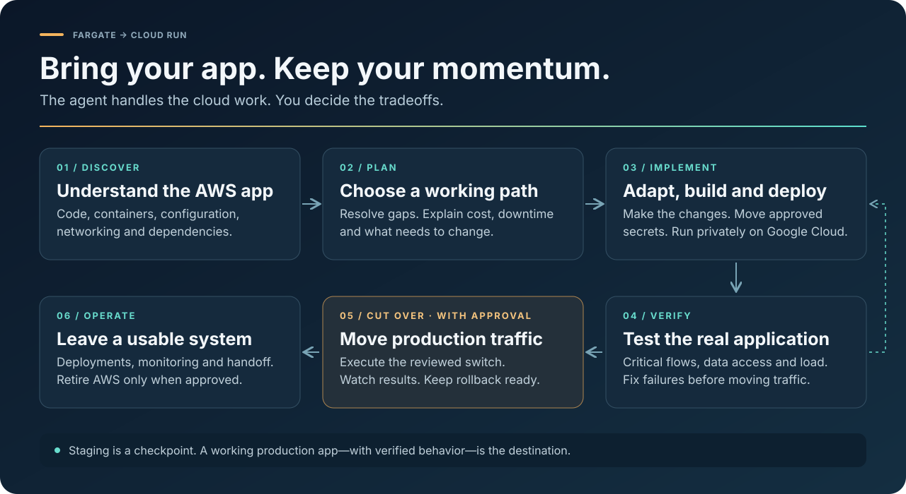

<p align="center">
  
</p>

# Fargate → Cloud Run

**Move your AWS app to Google Cloud Run without learning a second cloud from scratch.**

An agent skill that inspects your ECS/Fargate application, works out the changes it needs,
implements them, deploys to Cloud Run, tests real behavior, and carries out a reviewed production
cutover. You provide access and decide the important tradeoffs. The agent does the cloud work.



[Get started](#get-started) · [How it works](#how-it-works) · [What it handles](#what-it-handles) · [Trust and limits](#trust-and-limits) · [Contribute](#contribute)

> **Status: early release.** The local helpers have automated regression tests. The full agent-led
> workflow still needs independent, real-world migration validation. This is not a one-click guarantee
> for every ECS workload. Staging is part of the workflow, not its final objective.

## Get started

Install it in your coding agent:

```bash
npx skills add Robertzu43/fargate-to-cloudrun
```

Open your application's repository and ask:

> Migrate my Fargate application to Cloud Run. Inspect AWS and the code, make the necessary changes,
> deploy and test it, then help me switch production. Ask me before moving live traffic.

You do not need to know the Google Cloud product names or write deployment commands. If you do not
know your ECS service names, the agent can discover them. If several unrelated apps exist, it will ask
which one you mean.

**Start with:** Python 3.9+, an authenticated AWS CLI, and the application's source code when available.
The agent helps you set up Google Cloud access, a billing-enabled project, appropriate permissions and
Docker when they are needed. **Google Cloud setup is not required for the initial assessment.**

The skill uses ordinary CLI commands and `SKILL.md` instructions for agents such as Claude Code,
Codex, and Gemini CLI. Full end-to-end behavior across those agents has not yet been independently verified.

<details>
<summary>Manual installation</summary>

From your application repository, install into the location your agent reads:

```bash
# Claude Code
 git clone https://github.com/Robertzu43/fargate-to-cloudrun .claude/skills/fargate-to-cloudrun

# Codex / shared agent skills directory
 git clone https://github.com/Robertzu43/fargate-to-cloudrun .agents/skills/fargate-to-cloudrun
```

For other agents, use their supported skill installation flow. The scripts must remain next to `SKILL.md`.

</details>

## How it works

| Step | The agent does | You decide |
|---|---|---|
| **Discover** | Reads the app, ECS configuration, images, networking, identities and dependencies. | Which application to move, if ambiguous. |
| **Plan** | Determines what can move directly, what needs changes, and the cost/downtime implications. | Budget, acceptable downtime and consequential behavior changes. |
| **Implement** | Updates code and infrastructure, configures Google resources, and transfers approved secrets. | Access and approval for the reviewed resource/secret-transfer scope. |
| **Verify** | Deploys privately, tests critical application flows and fixes failures. | Whether observed results meet your business requirements. |
| **Cut over** | Prepares and executes the actual production routing/data-writer switch, with monitoring and rollback. | Approval for the concrete production change. |
| **Operate** | Updates deployment instructions or CI/CD and documents monitoring, costs and remaining dependencies. | When the rollback window is over and AWS resources may be retired. |

The agent keeps a `migration.md` record in your project: what it found, what changed, what it tested,
and what happens next. It explains decisions in plain language and does not require approval for
repeated read-only checks. You can approve a batch of destination changes; production cutover and
AWS deletion remain separate decisions.

## What it handles

There are two parts: **deterministic helpers for common mappings** and **an agent workflow for the
application-specific work**. The distinction matters—an instruction to investigate is not a tested converter.

| Area | Current capability |
|---|---|
| ECS HTTP services | Inventory, field assessment, and YAML/CLI generation for the resolved single-service path. Repeat discovery per service for a multi-service app. |
| Application changes | The agent edits source/build/configuration as needed, tests the changes, and builds the actual target image. |
| Secrets Manager / SSM | Explicitly approved transfer helper, including JSON-key/version selectors; values stay out of terminal output and destination versions are recorded. |
| Networking, sidecars, jobs, workers | The agent investigates current official docs and authors the appropriate configuration. These are not automatically converted by the HTTP generator. |
| Databases, queues and storage | The agent chooses and implements an approved retain/move/replace strategy. Data migrations need engine-specific procedures, validation and rollback planning. |
| Production cutover | Agent-executed, reviewed changes for the application's actual front door and data ownership. There is no generic cross-cloud traffic-switch command. |
| AWS retirement | Separately approved after verification and the rollback window, with shared-resource and backup checks. |

Some workloads need a different target or architectural changes. The agent should explain the exact
mismatch and propose an approach—not silently remove the feature or pretend Cloud Run supports it.

## Trust and limits

**A supported field is not a migrated application.** The assessor's internal `rollup: supported` means
its checked mappings passed. The user-facing result is **candidate for validation**. Source scanning is
heuristic, and the inventory explicitly lists areas the agent must still investigate.

**The generator does not silently omit unresolved requirements.** Redacted configuration, missing
load-balancer evidence, unsupported features and other open findings stop executable generation. The
agent resolves them or authors and verifies the required configuration directly. It must not edit the
original evidence or suppress findings to force a pass.

**Secret values stay out of the conversation.** Environment values are withheld by default. Explicit
`--include-env NAME` options allow reviewed non-secret values. Other fields have best-effort redaction;
inventories must still be treated as sensitive. The optional transfer helper reads only the approved
AWS references and sends values to Google through process pipes. It writes version metadata, not values.

**Documentation is evidence, not a proof system.** Mapping rules include official links and excerpts.
A scheduled check detects missing excerpts; a maintainer must review and distribute updated rules.
It does not detect every semantic platform change or automatically update installed copies. The agent
can consult current official documentation and record decisions beyond the bundled rules.

**Production completion needs functional evidence.** A health endpoint alone does not verify your
credentials, database, queue, files, authentication or actual user flows. Cutover requires those checks,
monitoring and a viable rollback plan. Traffic rollback alone cannot recover writes made only to a new database.

**Cloud operations can cost money.** Minimum instances, databases, networks, registries, secrets and logs
may all incur charges. The agent estimates and reviews the planned resources. Deleting the Cloud Run
service alone does not clean up everything. Project Owner is not a prerequisite; permissions should match
the operations being performed.

## Try the helpers without cloud access

The fixtures exercise the local assessment and generator. They do not demonstrate a completed live migration.

```bash
python3 scripts/assess.py \
  --inventory fixtures/stateless-http/inventory.json \
  --src fixtures/stateless-http/src \
  --out assessment.json

# Prints proposed source/destination references. No values are read; no provider calls are made.
python3 scripts/transfer_secrets.py --assessment assessment.json --project my-project

python3 -m unittest discover -s tests -v
```

For an application that has secrets, executable generation requires the actual destination versions:

```bash
# Only after the user has approved the source references and destination project.
# Secret Manager must be enabled and the operator must have the required permissions.
python3 scripts/transfer_secrets.py --assessment assessment.json \
  --project my-project --apply --versions-out secret-versions.json

python3 scripts/generate.py --inventory inventory.json --assessment assessment.json \
  --project my-project --region us-central1 \
  --secret-versions secret-versions.json --out-dir out
```

Do not run the synthetic fixture's transfer with `--apply`: its AWS references are examples.
The deployed artifacts are `out/service.yaml` and `out/deploy.sh`. The agent reviews and executes them
within the approved scope, then runs application-level verification. For apps without secrets, omit
`--secret-versions`.

See [the functional example](examples/configured-api/README.md) for a small application that distinguishes
“the server is up” from “the required configuration and application behavior work.”

## Repository map

| File | Purpose |
|---|---|
| [`SKILL.md`](SKILL.md) | Agent instructions from discovery through production handoff. |
| [`references/migration-workflow.md`](references/migration-workflow.md) | Dependency investigation, implementation, testing, cutover and rollback procedures. |
| [`scripts/inventory.py`](scripts/inventory.py) | Read-only AWS configuration collection with environment values withheld by default. |
| [`scripts/assess.py`](scripts/assess.py) | Evidence-linked findings and explicit coverage limitations. |
| [`scripts/generate.py`](scripts/generate.py) | Executable configuration for resolved HTTP mappings; refuses unresolved findings. |
| [`scripts/transfer_secrets.py`](scripts/transfer_secrets.py) | Plan or explicitly perform secret-value transfers without displaying values. |
| [`references/rules.json`](references/rules.json) | Reviewed mappings, platform constraints and source references. |
| [`tests/`](tests/) | Regression tests for assessment, generation, secret handling and functional verification. |

## Contribute

The most useful contribution is evidence from a real migration: a sanitized configuration, the expected
behavior, what failed, and the smallest reproducible test. Never attach raw inventories or credentials.

Before proposing a new mapping, include a current official reference and tests for both its supported
case and a case that must not pass. A fixture matching generated text is not enough to prove semantics.
Run `python3 -m unittest discover -s tests -v`. Maintainers can check documentation excerpts with
`python3 scripts/docdrift.py`; review any changes before writing stale flags or updating citations.

Current validation goal: independent engineers migrate real applications with less manual work than the
same agent without this skill, while finding consequential blockers and avoiding false compatibility claims.
Until that evidence exists, the repository remains an early release.

## License

Apache 2.0. Referenced Google documentation is attributed under CC-BY 4.0 in [NOTICE](NOTICE).
“Fargate” and “Cloud Run” describe the source and destination. This project is not affiliated with or
endorsed by Amazon or Google.
